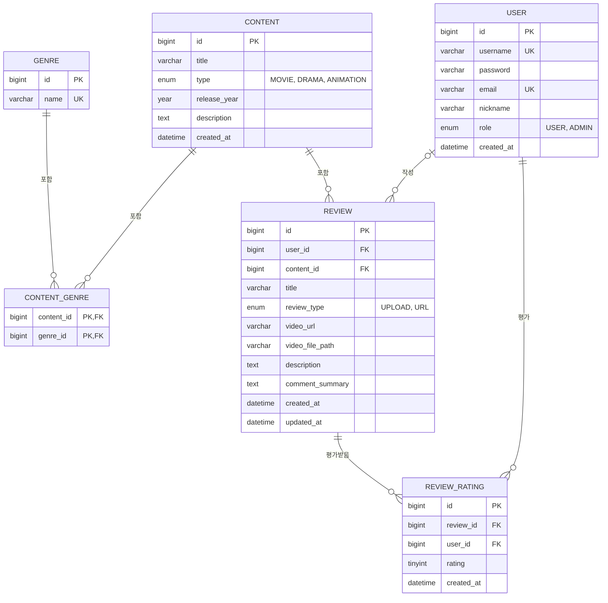

# ReelView ERD

## 관계 설명

| 관계 | 설명 |
|------|------|
| USER \|o--o{ REVIEW | 한 명의 유저가 리뷰를 0개 이상 작성/큐레이션 (1:N). user_id는 NULL 허용 — 유저 탈퇴 시 SET NULL, 리뷰는 보존 |
| CONTENT \|\|--o{ REVIEW | 한 작품에 리뷰가 0개 이상 달림 (1:N). 리뷰가 있으면 작품 삭제는 RESTRICT |
| CONTENT \|\|--o{ CONTENT_GENRE | 한 작품이 여러 장르 매핑을 가질 수 있음 |
| GENRE \|\|--o{ CONTENT_GENRE | 한 장르가 여러 작품에 매핑될 수 있음 (CONTENT-GENRE는 결과적으로 N:M) |
| USER \|\|--o{ REVIEW_RATING | 한 명의 유저가 여러 리뷰를 평가 (1:N) |
| REVIEW \|\|--o{ REVIEW_RATING | 한 리뷰가 여러 유저에게 평가받음 (1:N). USER-REVIEW는 결과적으로 N:M. 평점(1차 콘텐츠 X, 2차 콘텐츠인 리뷰 영상 O)은 review_rating의 평균값으로 계산 |
